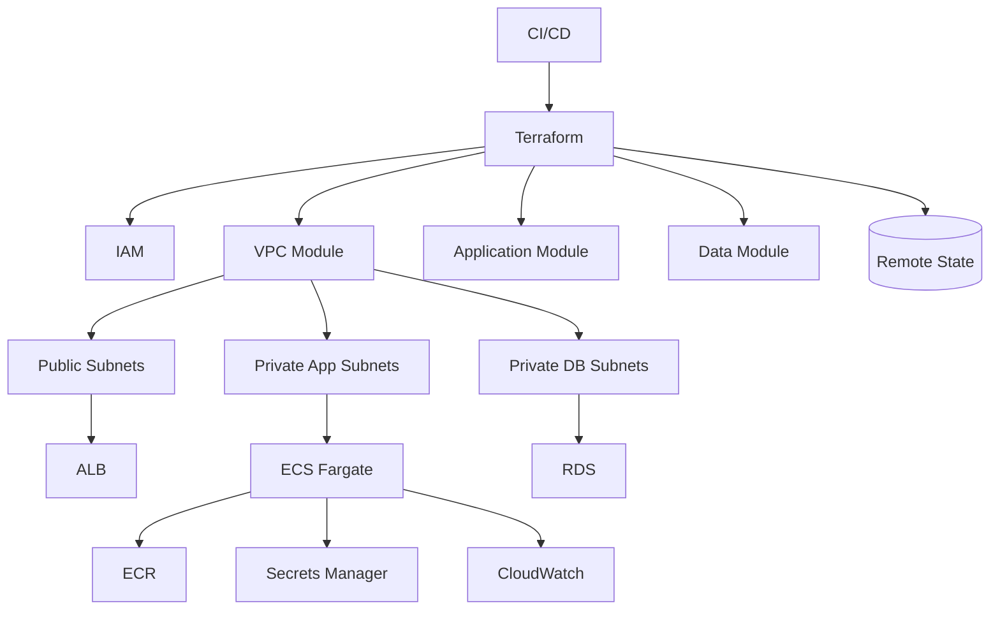

# AWS Terraform Reference Architecture

```mermaid
flowchart TB
 CI[CI/CD] --> TF[Terraform]
 TF --> IAM[IAM]
 TF --> VPC[VPC Module]
 TF --> APP[Application Module]
 TF --> DATA[Data Module]
 VPC --> PUB[Public Subnets]
 VPC --> PRI[Private App Subnets]
 VPC --> DB[Private DB Subnets]
 PUB --> ALB[ALB]
 PRI --> ECS[ECS Fargate]
 DB --> RDS[RDS]
 ECS --> ECR[ECR]
 ECS --> SM[Secrets Manager]
 ECS --> CW[CloudWatch]
 TF --> ST[(Remote State)]
```
