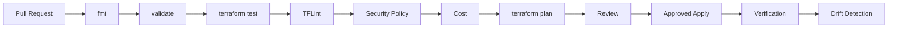

# Production Terraform Pipeline

```mermaid
flowchart LR
 PR[Pull Request] --> F[fmt]
 F --> V[validate]
 V --> T[terraform test]
 T --> L[TFLint]
 L --> S[Security Policy]
 S --> C[Cost]
 C --> P[terraform plan]
 P --> R[Review]
 R --> A[Approved Apply]
 A --> Q[Verification]
 Q --> D[Drift Detection]
```
