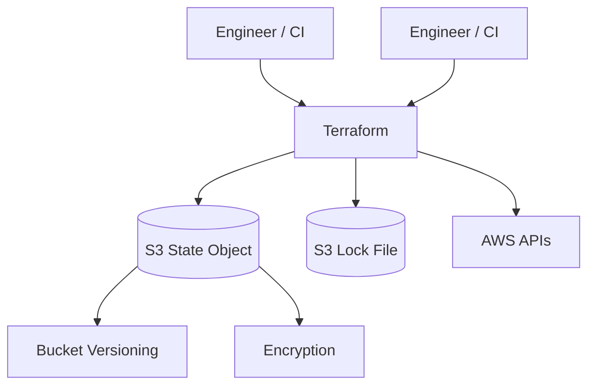

# Remote State with S3

Current HashiCorp guidance documents S3 locking with `use_lockfile = true` and recommends bucket versioning for recovery. DynamoDB locking is documented as deprecated. citeturn726687search0
