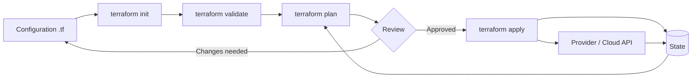

# Terraform Core Workflow

```mermaid
flowchart LR
  C[Configuration .tf] --> I[terraform init]
  I --> V[terraform validate]
  V --> P[terraform plan]
  P --> R{Review}
  R -->|Approved| A[terraform apply]
  R -->|Changes needed| C
  A --> S[(State)]
  A --> AWS[Provider / Cloud API]
  AWS --> S
  S --> P
```

Terraform documents init, validate, plan, apply and destroy as the main CLI commands. citeturn726687search4
