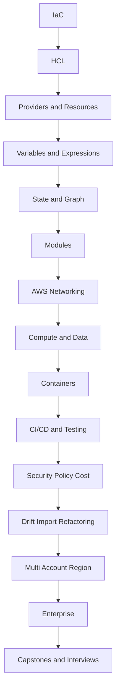

# Terraform Learning Map

```mermaid
flowchart TB
 A[IaC] --> B[HCL]
 B --> C[Providers and Resources]
 C --> D[Variables and Expressions]
 D --> E[State and Graph]
 E --> F[Modules]
 F --> G[AWS Networking]
 G --> H[Compute and Data]
 H --> I[Containers]
 I --> J[CI/CD and Testing]
 J --> K[Security Policy Cost]
 K --> L[Drift Import Refactoring]
 L --> M[Multi Account Region]
 M --> N[Enterprise]
 N --> O[Capstones and Interviews]
```
